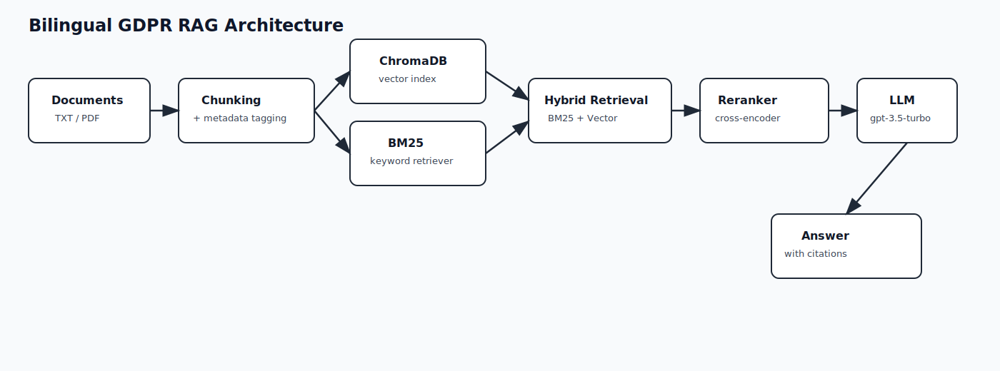

# Document Intelligence — Bilingual GDPR RAG (French / English)

A production-style Retrieval-Augmented Generation (RAG) application for GDPR/legal policy analysis with bilingual workflows, source-grounded answers, and document-level transparency.

## What It Does

- Lets users choose French or English mode in the Streamlit UI.
- Lets users choose which source document to use for that language.
- Answers questions with streaming output from OpenAI.
- Uses hybrid retrieval (BM25 + vector similarity) plus cross-encoder reranking.
- Supports exhaustive "research mode" automatically for list/all/every-type questions.
- Shows source citations for every answer, including filename, section, chunk index, and page number for PDFs.
- Lets users view full document text and download source PDFs from the UI.

## Stack

| Component | Technology |
|---|---|
| LLM | OpenAI `gpt-3.5-turbo` via `langchain-openai` |
| Embeddings | OpenAI `text-embedding-3-small` |
| Vector Store | ChromaDB (persistent on disk) |
| Retrieval | Hybrid BM25 + Vector (`EnsembleRetriever`) |
| Reranking | `BAAI/bge-reranker-base` cross-encoder |
| Document Parsing | `pymupdf` for native text-based PDFs, `TextLoader` for TXT |
| UI | Streamlit (dark theme, chat, sources, doc viewer/download) |
| Runtime | Python 3.11 (Conda env) |

## Supported Documents

- `.txt`
- Native text `.pdf` (no OCR)

Drop source files into [documents](documents).

## Architecture



```text
Documents (.txt / .pdf)
        |
        v
Chunking + metadata (source, section, page, chunk_index)
        |
        v
ChromaDB embeddings index  +  BM25 keyword index
        |                         |
        +------ Hybrid retrieval--+
                     |
                     v
            Cross-encoder reranker
                     |
                     v
                 OpenAI LLM
                     |
                     v
   Streamlit answer + citations + page references
```

## Environment Variables

Create [.env](.env) from [.env.example](.env.example):

```bash
OPENAI_API_KEY=your_key_here
```

Required:
- `OPENAI_API_KEY`

## Run Locally

### 1. Install dependencies

```bash
pip install -r requirements.txt
```

### 2. Start app

Preferred (this project):

```bash
c:\RAG\.conda\python.exe -m streamlit run st_app.py
```

Open:
- `http://localhost:8501`

### 3. First indexing

On first launch (or after changing source docs/language selection), the app builds a Chroma collection and BM25 index from selected documents.

## Run with Docker

```bash
docker compose up --build
```

Stop:

```bash
docker compose down
```

Persistence:
- [documents](documents) is mounted into container
- [chroma_db](chroma_db) is mounted into container

So vector data persists across container restarts.

## Deploy on Render

This repo includes [render.yaml](render.yaml) for Blueprint deployment.

1. Push repository to GitHub.
2. In Render, create a new Blueprint and point to this repository.
3. Set `OPENAI_API_KEY` in Render environment variables.
4. Deploy.

The service uses:
- `buildCommand`: `pip install -r requirements.txt`
- `startCommand`: `python -m streamlit run st_app.py --server.port $PORT --server.address 0.0.0.0`

## Current Project Structure

```text
RAG/
├── documents/                  # Source documents (.txt/.pdf)
├── chroma_db/                  # Persistent vector DB (generated)
├── archive/
│   └── build_rag.py            # Legacy RagBuilder prototype (archived)
├── .streamlit/
│   └── config.toml             # Streamlit theme/server config
├── rag.py                      # Core bilingual RAG pipeline
├── st_app.py                   # Streamlit UI
├── requirements.txt
├── Dockerfile
├── docker-compose.yml
├── .env.example
└── README.md
```

## Notes

- Source citations are first-class: every answer includes explicit supporting chunks.
- Research mode auto-activates on exhaustive queries (all/every/list/enumerate/find all).
- PDF extraction is native text only; scanned PDFs are intentionally out of scope.

## Contributing

See [CONTRIBUTING.md](CONTRIBUTING.md) for development workflow and review checklist.
